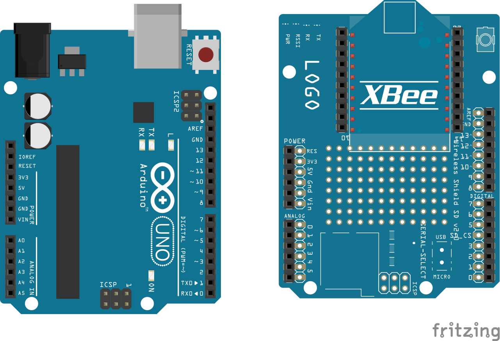

# xBEE Library

This is a library helping us to develop IoT devices that would communicate with xBEE protocol 802.15.4



## Getting Started

### Add manually this library to your Arduino libraries

**More info:** https://www.arduino.cc/en/Guide/Libraries

### Using the coding sample

```cpp
#include <xBEE.h>

xBEE xbee = xBEE("255C");

void setup() {  
  Serial.begin(9600);
  
  xbee.AutoConfigure();
}

void loop() {
  if(!xbee.Available()) { return; }
  
  String input = xbee.Read();
  
  Serial.print(input);
}
```

#### Configure the network manually

```cpp
#include <xBEE.h>

xBEE xbee = xBEE();

void setup() {  
  Serial.begin(9600);
  
  xbee.Configure();
  
  // Configures the network
  xbee.Set("CH", "C");
  xbee.Set("ID", "24C7");
  xbee.Set("MY", "255C");

  // Configures the node
  xbee.Set("NI", "24C7");

  // Configures communications
  xbee.Set("DH", "0013A200");
  xbee.Set("DL", "417C255C");

  // Configures data encryption
  xbee.Set("EE", "1");
  xbee.Set("KY", "777D7EE5DB70B3880A062ED14F5568E6");

  xbee.Start();
}

void loop() {
  if(!xbee.Available()) { return; }
  
  String input = xbee.Read();
  
  xbee.Send(input);
}
```

## Documentation

### Constructors

* ``xBEE()``: Default constructor without any parameters
* ``xBEE(String ni)``: Constructor with Node Identifier parameter
* ``xBEE(String ni, String ky)``: Constructor with Node identifier and AES encryption Key

### Configuration

* ``AutoConfigure()``: Configures the xBEE module to auto configure and auto-associate to a coordinator.
* ``IsAssociated()``: Checks if the xBee is associated to a network.
* ``Configure()``: Starts the configuration of xBEE module.
* ``Start()``: Writes the configuration to the xBEE module and finishes the configuration of xBEE module.
* ``Set(String configuration, String value)``:  Sets the value of the xBEE register.
* ``Get(String configuration)``: Gets the value of the xBEE register.

### Communication

* ``Send(String dl, String dh, String content)``: Sends a message to a remote device specified by DH, DL.
* ``Send(String dl, String content)``: Sends a message to a remote device specified by MY.
* ``Send(String content)``: Sends a message the de configured destination device.
* ``Available()``: Checks if a message is availiable on the xBEE module.
* ``Read(String content)``: Reads the availiable message.

